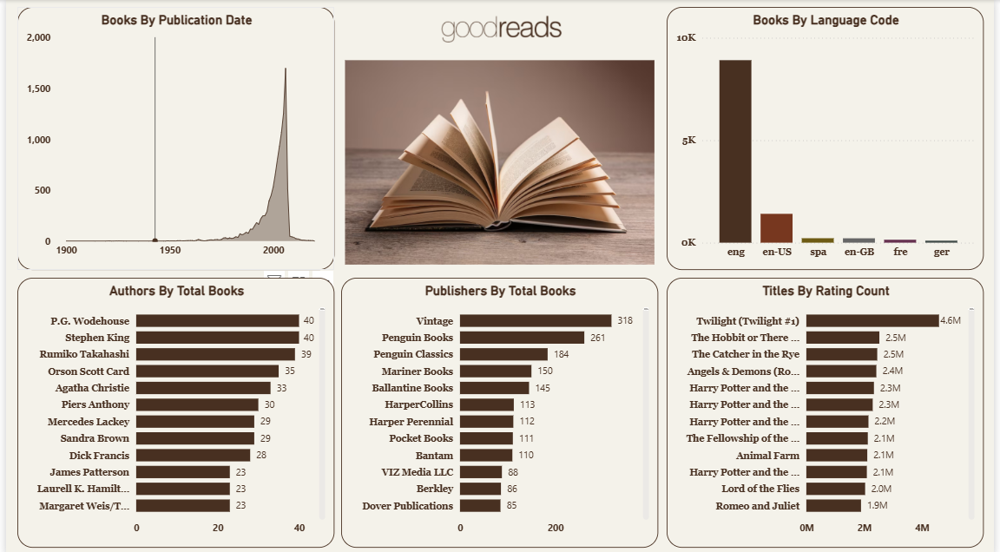

# 📚 Goodreads Data Dashboard | Power BI

## 🎯 Business Problem

Book publishers, authors, and readers need clear insights into publication trends, language distribution, author productivity, publisher performance, and reader engagement. Without a centralized analytics solution, it is difficult to identify market trends, understand audience preferences, and evaluate publishing performance.

---

## 📊 Overview

This project presents an interactive **Power BI dashboard** that transforms Goodreads book data into meaningful business insights. The dashboard enables users to analyze publication history, language diversity, leading authors, top publishers, and reader engagement through interactive visualizations.

---

## 🛠️ Dashboard Features

- Publication trend analysis by year
- Books categorized by language
- Top authors by total books published
- Publisher performance comparison
- Most-rated books analysis
- Interactive filtering and cross-highlighting
- Clean and intuitive dashboard design

---

## 📌 KPIs

- **Books Published by Year**
- **Books by Language Code**
- **Top Authors by Total Books**
- **Top Publishers by Total Books**
- **Most Rated Book Titles**

---

## 🔍 Key Insights

- Book publications increased significantly after the mid-20th century, reflecting the rapid growth of the publishing industry.
- English-language books dominate the dataset, with additional representation across several other languages.
- Authors such as **P.G. Wodehouse**, **Stephen King**, and **Rumiko Takahashi** rank among the most prolific writers.
- Publishers including **Vintage**, **Penguin Books**, and **Penguin Classics** have published the highest number of books.
- Popular titles such as **Twilight** and **The Hobbit** demonstrate exceptionally high reader engagement based on rating counts.

---

## 🛠️ Tools & Technologies

- 
- 
- 
- 
- 
- 
- 
- 

---

## 🚀 Skills Demonstrated

- Data Analysis & Reporting
- Business Intelligence Development
- Data Modeling
- DAX Measures
- Dashboard Design
- Data Visualization
- KPI Development
- Business Insights

---

---

## 📸 Dashboard Preview

---

## 📂 How to Use

1. Download or clone this repository.
2. Open the `Book Store.pbix` file using **Power BI Desktop**.
3. Load the provided dataset if prompted.
4. Explore the interactive visuals to analyze publication trends, authors, publishers, languages, and reader engagement.

---

## 🔮 Future Enhancements

- Add genre-based analysis and filtering.
- Incorporate sentiment analysis using book reviews.
- Build forecasting models for publication trends.
- Integrate Goodreads API for real-time data updates.
- Expand author and publisher performance metrics.
